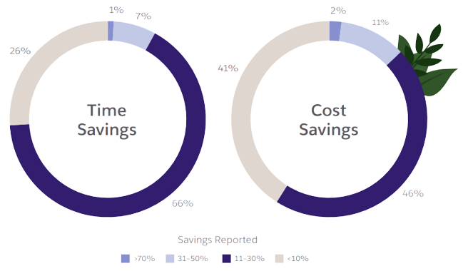

<BlogPostHero />

Workflow automation is crucial for businesses looking to increase efficiency and streamline processes in today's competitive business environment. By automating manual, time-consuming workflows, organizations can work smarter rather than harder. The benefits of workflow automation are clear, with around [95%](https://www.salesforce.com/content/dam/web/en_us/www/documents/platform/2021-trends-in-workflow-automation-report-2.pdf) of IT and technical leaders prioritizing it according to a report by Salesforce.

In this blog post, we explore the importance of workflow automation and provide tips and best practices for implementing it in your organization. These include assessing current workflows, involving key stakeholders, selecting the right tools and technologies, and providing ongoing training and support. By following these recommendations, businesses can ensure that automation is delivering maximum value and helping them stay ahead of the competition.

## The Pitfalls of Manual Workflows

In manual workflows, information or data is often processed and transmitted between individuals or systems manually, rather than being automated or aided by technology. These processes are in most cases time-consuming, prone to error, and oversaturate people. Even in today's digital age, many organizations rely on manual labor for even basic tasks such as:

- **Data entry**,
- **Invoice processing**,
- **Work distribuition**
- **File organization**,
- **Customer service**, and
- **Expense reporting**.

There are several pitfalls associated with manual workflows in organizations, including:

- **Inefficiency**: Manual processes can be time-consuming and tedious, leading to inefficiencies in the workplace.
- **Error-prone**: Manual workflows rely on human input, and as a result, they are prone to errors. These errors can result in costly mistakes or delays.
- **Frustration**: Manual processes can be frustrating for employees and customers, as they may feel like they are wasting time or resources on tasks that could be automated.
- **Lack of visibility**: It can be difficult to track the progress of manual workflows and identify bottlenecks or inefficiencies.
- **Limited scalability**: Manual processes may not be able to keep up with increased demand or growth, making it difficult for businesses to scale.

## The benefits of Workflow Automations

Nearly all enterprise IT decision makers ([97%](https://camunda.com/wp-content/uploads/2020/10/Camunda-State-Of-Process-Automation.pdf)) recognize the importance of process automation in their digital transformation journey. Workflow automation is widely seen as a key enabler of innovation and a critical factor in achieving business objectives. The many benefits of automating manual workflows include:

- **Increased productivity**: Automation can help businesses complete tasks faster and more accurately, freeing up time for employees to focus on higher-value tasks.
- **Improved customer satisfaction**: Automated processes can provide a faster and more seamless experience for customers, leading to increased satisfaction.
- **Scalability**: Automation allows businesses to scale processes in a sustainable way, allowing them to keep up with increased demand or growth.
- **Improved accuracy**: Automated processes are less prone to errors compared to manual workflows, leading to increased accuracy and reliability.
- **Cost savings**: Automation can help businesses save money by reducing labor costs and increasing efficiency.
- **Increased competitiveness**: Automation can help businesses stay ahead of the competition by increasing efficiency and productivity, and enabling them to take on larger projects or expand into new markets.

 Approximately [75%](https://www.salesforce.com/content/dam/web/en_us/www/documents/platform/2021-trends-in-workflow-automation-report-2.pdf) of technical leaders who have implemented automation report time savings equivalent to at least four hours per 40-hour week. By automating manual tasks, employees are able to focus on more strategic and value-added activities, leading to increased efficiency and productivity for the organization.

 <a href= "https://www.salesforce.com/content/dam/web/en_us/www/documents/platform/2021-trends-in-workflow-automation-report-2.pdf"> [source]</a> 

Automation can bring numerous benefits to businesses, including increased efficiency, cost savings, improved customer satisfaction, and increased competitiveness. By automating manual workflows, organizations can work smarter, not harder, and achieve better results with fewer resources. Successful organizations understand the importance of leveraging automation to stay ahead in today's dynamic business environment.

## Implementing Workflow Automation in your Organization

Implementing workflow automation in your organization can seem daunting, but it doesn't have to be. It is important to carefully assess your current workflows and identify the areas where automation could be most beneficial. From there, you can decide on the best tool to use to automate the workflow. UI-based no-code/low-code tools, which allow users to drag and drop components to automate simple workflows, can be useful in some cases. However, in many instances, custom coded solutions may be a better option as they offer greater flexibility and customization options, and are often more suitable for automating complex or nuanced workflows or building software solutions that meet specific needs. Developers may also be more productive using code-centric approaches. It is important to carefully assess the needs and goals of your organization before deciding on a platform for automation or tool-building.

::: info Tip
Read this [blog post](technology-problems-of-ui-based-tools) if you're deciding on a platform to automate workflows.
:::

## Best Practices for Successful Workflow Automation

Best practices for implementing workflow automation in your organization include:

1. **Carefully assess current workflows** and identify the areas where automation could be most beneficial. This can help ensure that you are focusing on automating the right tasks and processes, and that you are maximizing the benefits of automation.
2. **Use flowcharts or process maps**, such as mermaid diagrams, to visually represent the steps and relationships in a process and identify opportunities for automation.
3. **Involve key stakeholders** in the process of identifying opportunities for automation. They may have valuable insights and perspectives on where automation could be most effective.
4. **Provide ongoing training and support** to ensure a smooth transition and successful adoption of automation. This can include training for employees who will be using the automated processes, as well as technical support for any issues that may arise.
5. **Regularly review and assess the performance** of your automation initiatives to ensure they are meeting your desired outcomes. This can involve tracking metrics such as time and cost savings, productivity improvements, and customer satisfaction. By regularly reviewing and adjusting your automation efforts, you can ensure that they are delivering the maximum value for your organization.

By following these best practices and tips, you can ensure a successful implementation of workflow automation in your organization.

## Conclusion

Workflow automation can greatly benefit businesses by increasing efficiency, reducing costs, improving customer satisfaction, and helping them stay competitive. When implementing automation, it is important to assess current workflows, involve key stakeholders, and choose the right tools and technologies. Custom coded solutions may be a better option than UI-based no-code/low-code tools for more complex or nuanced workflows or for building software solutions. Ongoing training and support, as well as regular review and assessment, can also help ensure the success of automation initiatives. By following these recommendations, businesses can ensure that automation is delivering maximum value.

Netzo's can help your organization streamline even the most complex workflows and take your business to the next level. If you're interested in learning more, don't hesitate to [request a demo](mailto:help@netzo.io?subject=%20How%20can%20we%20help%3F). We would be happy to hear more about your needs and help you.
