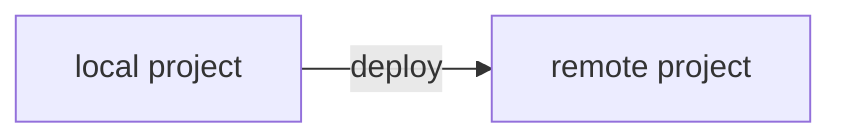
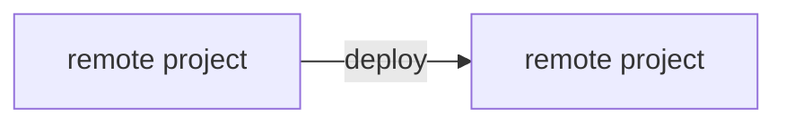

# How to Deploy

There are 2 ways to deploy your projects in Netzo. Note that to use any of these methods, you must first [create a project in the UI](/docs/platform/projects#creating-projects).

## Deploy via CLI



The recommended way to deploy projects is from the command line via the [netzo/cli](/docs/netzo/cli) command-line tool. This approach is great for developers who want to use their own editor and development environment. The CLI is also great for CI/CD pipelines.

- **IDE:** use your preffered editor (e.g. [VSCode](https://code.visualstudio.com))
- **Hot Reload:** preview your changes instantly with `deno run --watch`
- **GitOps:** version control your code (e.g. [GitHub](https://github.com))
- **CI/CD:** integrate  pipeline (e.g. [GitHub Actions](https://github.com/features/actions))

1. Install the `netzo/cli` command line tool

```sh
deno install -Arf https://deno.land/x/netzo/cli/netzo.ts
```

2. Configure your API key as an environment variable

```sh
export NETZO_API_KEY=... # Linux / MacOS
set NETZO_API_KEY=... # Windows
```

3. Create a project in [Netzo](https://app.netzo.io) if you haven't and copy the
project UID.

4. Deploy the project (pass the `--prod` flag to deploy to production)

```sh
netzo deploy --project=my-project <entrypoint>
```

See the [`netzo/cli`](/docs/netzo/cli) page for more details.

## Deploy via UI



The easiest way to deploy simple projects and prototypes is via the editor in [app.netzo.io](https://app.netzo.io). For more complex projects, we recommend setting up local development and [deploying via CLI](#deploy-via-cli).

See the [Creating Projects](/docs/platform/projects#creating-projects) page for more details.

::: warning
The in-app editor in [app.netzo.io](https://app.netzo.io) is currently in alpha and may have bugs that affect the development experience. We thus recommend taking advantage of traditional local development in the IDE of your choice and use the [netzo/cli](/docs/netzo/cli) command-line tool for deployment.
:::

<!-- ## Deploy with Github integration (soon)

[Coming soon] Netzo allows you to link a Netzo project to a GitHub repository.

Every time you push to the repository, your changes will be automatically deployed.

Via the Github integration, you can add a Github Action that defines a build step in your deployment process.

See the Github integration page for more details.

```mermaid
flowchart LR
    A[local project] --     >|push| B[github]
    B[github] --            >|deploy| C[remote project]
```

See the [Github integration](/docs/platform/github-integration) page for more details. -->
