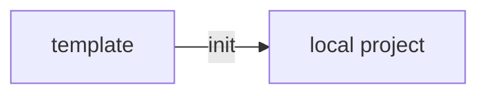
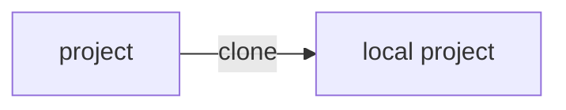
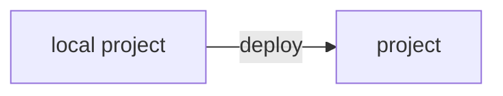
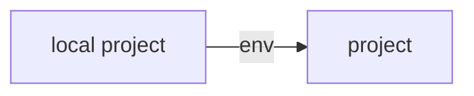

# `netzo/cli`

> [`https://deno.land/x/netzo/cli`](https://deno.land/x/netzo/cli)

**The `netzo/cli` module is a command line tool to streamline local development of projects in Netzo.** In essence, the CLI allows developers to create new projects from scratch or from existing templates, develop locally and deploy to Netzo with a single command. You can use the native Deno CLI to run your project locally.

## Installation

Make sure you have followed the [instructions](https://deno.com/manual@v1.34.1/getting_started/installation) to install the Deno CLI.

You can install the `netzo` CLI by running the following command:

```sh
deno install -Arf https://deno.land/x/netzo/cli/netzo.ts
```

## Authentication

Before being able to deploy, you need to get an API key from the
[Workspace > Settings > API keys](/docs/platform/workspaces#api-keys)
page. You can store this token in a `NETZO_API_KEY` environment variable

::: code-group
```sh [Linux / MacOS]
export NETZO_API_KEY=...
```
```sh [Windows]
set NETZO_API_KEY=...
```
:::

or pass it in the `--api-key` flag each time you run a `netzo` subcommand.

## Subcommands

The `netzo` CLI is a single executable that provides a number of subcommands. To see the full list of subcommands and options, run `netzo --help` or `netzo -h`.

### `init`

The `init` subcommand creates a new project from an existing template.



```sh
netzo init [OPTIONS] [<directory>]
```

**Options:**

| Option             | Description                                           |
|--------------------|-------------------------------------------------------|
| `-t`, `--template` | The UID of the template (omit to list options)        |
| `--dry-run`        | Dry run the initialization process (default: `false`) |
| `-h`, `--help`     | Prints help information                               |

**Arguments:**

| Argument      | Description                                                            |
|---------------|------------------------------------------------------------------------|
| `<directory>` | The directory path to initialize project in (defaults to `--template`) |

**Examples:**

```sh
# To create a new project from a template:
netzo init
# To create a new project from a specific template:
netzo init --template=starter-app
# To create a new project from a template in a custom directory:
netzo init path/to/directory
# To create a new project from a template in the current working directory:
netzo init .
```

### `clone`

The `clone` subcommand copies a project from Netzo to your local machine.



```sh
netzo clone [OPTIONS] [<directory>]
```

**Options:**

| Option             | Description                                                   |
|--------------------|---------------------------------------------------------------|
| `--api-key`        | The API key to use (default: `Deno.env.get("NETZO_API_KEY")`) |
| `--dry-run`        | Dry run the initialization process (default: `false`)         |
| `-h`, `--help`     | Prints help information                                       |
| `--p`, `--project` | The UID of the project to clone                               |

**Arguments:**

| Argument      | Description                                                            |
|---------------|------------------------------------------------------------------------|
| `<directory>` | The directory path to initialize project in (defaults to `--template`) |

**Examples:**

```sh
# To clone an existing project from Netzo:
netzo clone
# To clone an existing project by UID from Netzo:
netzo clone --project=my-project
# To clone a project from Netzo to a custom directory:
netzo clone path/to/directory
```

### `deploy`

The `deploy` subcommand deploys a local project to Netzo.



```sh
netzo deploy [OPTIONS] <entrypoint>
```

::: tip Set defaults for `project`, `entrypoint` in `netzo.config` to avoid passing options each time
Note that the options and arguments passed to the CLI will take precedence over these defaults.
:::

**Options:**

| Option             | Description                                                   |
|--------------------|---------------------------------------------------------------|
| `--api-key`        | The API key to use (default: `Deno.env.get("NETZO_API_KEY")`) |
| `--dry-run`        | Dry run the initialization process (default: `false`).        |
| `--exclude`        | Exclude files that match this pattern                         |
| `-h`, `--help`     | Prints help information                                       |
| `--include`        | Include files that match this pattern                         |
| `--import-map`     | Include files that match this pattern                         |
| `--no-static`      | Don't include the files in the CWD (default: `false`)         |
| `--prod`           | Create a `production`  (default: `false`)                     |
| `--p`, `--project` | The UID of the project to deploy to                           |

**Arguments:**

| Argument       | Description                                           |
|----------------|-------------------------------------------------------|
| `<entrypoint>` | The file path to the entrypoint file (e.g. `main.ts`) |

**Examples:**

```sh
# To deploy a local project:
netzo deploy --project=my-project main.ts
# To deploy a local project and mark it as production:
netzo deploy --project=my-project --prod main.ts
# To deploy a local project without static files:
netzo deploy --project=my-project --no-static main.ts
# To ignore the .env file while deploying:
netzo deploy --project=my-project --exclude=".env" main.tsx
```

### `env`

The `env` subcommand pushes environment variables from an `.env` file to a project in Netzo.



```sh
netzo env [OPTIONS] [<envPath>]
```

::: tip Set defaults for `project` in `netzo.config` to avoid passing options each time
Note that the options and arguments passed to the CLI will take precedence over these defaults.
:::

**Options:**

| Option             | Description                                                   |
|--------------------|---------------------------------------------------------------|
| `--api-key`        | The API key to use (default: `Deno.env.get("NETZO_API_KEY")`) |
| `-h`, `--help`     | Prints help information                                       |
| `--p`, `--project` | The UID of the project to update environment variables for    |

**Arguments:**

| Argument    | Description                                        |
|-------------|----------------------------------------------------|
| `<envPath>` | The file path to the env file (defaults to `.env`) |

**Examples:**

```sh
# To update environment variables from default .env file:
netzo env --project=my-project
# To update environment variables from a relative file path:
netzo env --project=my-project ./.env.production
```

::: warning New environment variables will override existing ones.
:::

<!-- ### `logs` (soon)

The `logs` subcommand streams the logs of a project in real-time.

```sh
netzo logs --project=my-project
``` -->

### `upgrade`

```sh
netzo upgrade [OPTIONS] [<version>]
```

**Options:**

| Option         | Description             |
|----------------|-------------------------|
| `-h`, `--help` | Prints help information |

**Arguments:**

| Argument    | Description                                           |
|-------------|-------------------------------------------------------|
| `<version>` | The file path to the entrypoint file (e.g. `main.ts`) |

**Examples:**

```sh
# To upgrade to the latest version.
netzo upgrade
# To upgrade to a specific version e.g. `0.0.1`:
netzo upgrade 0.0.1
```

## Deno CLI

All projects in Netzo are Deno projects and can be run locally using the Deno CLI. To install deno, follow the instructions in the [Deno manual](https://deno.com/manual@v1.34.1/getting_started/installation).

```sh
# After installation, you can run your scripts locally:
deno run --allow-net=:8000 main.ts
# To watch for file changes add the `--watch` flag:
deno run --allow-net=:8000 --watch main.ts
```

::: tip Local development setup
Be sure to follow the [Getting Started](https://deno.com/manual/getting_started) section to install the CLI and configure your IDE.
:::
